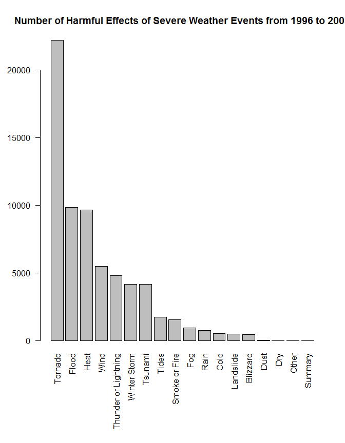
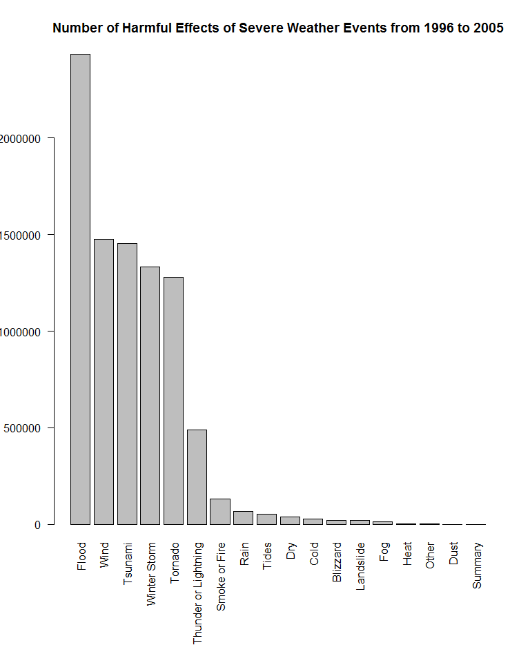

# An Analysis of the Harmful Health Effects and Economic Cost of Severe Weather Events
Robert Stober  
July 27, 2014  
##Synopsis

Storms and other severe weather events can cause both public health and economic problems for communities and municipalities. Many severe events can result in fatalities, injuries, and property damage, and preventing such outcomes to the extent possible is a key concern.

This project involves exploring the U.S. National Oceanic and Atmospheric Administration's (NOAA) storm database. This database tracks characteristics of major storms and weather events in the United States, including when and where they occur, as well as estimates of any fatalities, injuries, and property damage.

For harmful health effects the analysis concluded that Tornado, Heat and Flood were the were the event types resulting in the most fatalities and injuries.

For economic cost the analysis concluded that Flood, Wind, Tsunami, Winter Sorms and Tornadoes were the event types resulting in the most economic losses.

## Data Processing

The data for this assignment come in the form of a comma-separated-value file compressed via the bzip2 algorithm to reduce its size. You can download the file from the course web site:

https://d396qusza40orc.cloudfront.net/repdata%2Fdata%2FStormData.csv.bz2

There is also some documentation of the database available. Here you will find how some of the variables are constructed/defined.

National Weather Service Storm Data Documentation

National Climatic Data Center Storm Events FAQ

The events in the database start in the year 1950 and end in November 2011. In the earlier years of the database there are generally fewer events recorded, most likely due to a lack of good records. More recent years should be considered more complete.

### Load Data

The following code loads and data set. It then displays it;s structure and a few rows of data. 


```r
##But fair warning, if I wanted to make changes to that particular chunk later and it was already cached, I had to delete it from the ./cache folder that it creates. Simply removing the cache=TRUE or adding cache=FALSE still kept using the old cache file. :/

## define columns to read
## if null wont read
## below brings in c("BGN_DATE", "STATE", "EVTYPE", "FATALITIES", "INJURIES", "PROPDMG", "PROPDMGEXP", "CROPDMG", "CROPDMGEXP", "LATITUDE", "LONGITUDE", "REFNUM")
toRead = c("NULL", "character", rep("NULL", 4), "character", "character", rep("NULL", 14), "numeric", "numeric", "numeric", "character", "numeric", "character", rep("NULL", 3), "numeric", "numeric", rep("NULL", 3), "numeric")

## Read in storm data 
## set strings as factors to false so dates are not interperted as factors
stormData<-read.csv("repdata-data-StormData.csv", stringsAsFactors=FALSE,colClasses = toRead)

## convert character to date type
stormData$BGN_DATE<-as.Date(stormData$BGN_DATE, format="%m/%d/%Y")

## Data for years prior to 1996 is incomplete and might be incorrect. 
stormDataSince1996<-stormData[stormData$BGN_DATE>=as.Date('1996-1-1'),]

## Look at structure of data
str(stormData)
```

```
## 'data.frame':	902297 obs. of  12 variables:
##  $ BGN_DATE  : Date, format: "1950-04-18" "1950-04-18" ...
##  $ STATE     : chr  "AL" "AL" "AL" "AL" ...
##  $ EVTYPE    : chr  "TORNADO" "TORNADO" "TORNADO" "TORNADO" ...
##  $ FATALITIES: num  0 0 0 0 0 0 0 0 1 0 ...
##  $ INJURIES  : num  15 0 2 2 2 6 1 0 14 0 ...
##  $ PROPDMG   : num  25 2.5 25 2.5 2.5 2.5 2.5 2.5 25 25 ...
##  $ PROPDMGEXP: chr  "K" "K" "K" "K" ...
##  $ CROPDMG   : num  0 0 0 0 0 0 0 0 0 0 ...
##  $ CROPDMGEXP: chr  "" "" "" "" ...
##  $ LATITUDE  : num  3040 3042 3340 3458 3412 ...
##  $ LONGITUDE : num  8812 8755 8742 8626 8642 ...
##  $ REFNUM    : num  1 2 3 4 5 6 7 8 9 10 ...
```

```r
## Look at first few of data
head(stormData)
```

```
##     BGN_DATE STATE  EVTYPE FATALITIES INJURIES PROPDMG PROPDMGEXP CROPDMG
## 1 1950-04-18    AL TORNADO          0       15    25.0          K       0
## 2 1950-04-18    AL TORNADO          0        0     2.5          K       0
## 3 1951-02-20    AL TORNADO          0        2    25.0          K       0
## 4 1951-06-08    AL TORNADO          0        2     2.5          K       0
## 5 1951-11-15    AL TORNADO          0        2     2.5          K       0
## 6 1951-11-15    AL TORNADO          0        6     2.5          K       0
##   CROPDMGEXP LATITUDE LONGITUDE REFNUM
## 1                3040      8812      1
## 2                3042      8755      2
## 3                3340      8742      3
## 4                3458      8626      4
## 5                3412      8642      5
## 6                3450      8748      6
```


### Preprocessing

The following code groups the event type into a more general classification. The original data set had 845 distinct event types. There are 48 official event types in use since 1996. In order to facillitate analysis, regular expressions were used to refactor these into 18 types. See addendum for more info.


```r
##creat new event Group Column initilaized to lower case of evtype
stormDataSince1996$event<-tolower(stormDataSince1996$EVTYPE)

##Do some grouping
##Summary
rowsToUpdate<-grepl(pattern = "*summary*", x = stormDataSince1996$event)
stormDataSince1996$event[rowsToUpdate] <- "Summary"

##Tides or surf
rowsToUpdate<-grepl(pattern = "*tide*|*surf*|*coast*|*seas*|*marine*|*current*|*wave*", x = stormDataSince1996$event)
stormDataSince1996$event[rowsToUpdate] <- "Tides"

## avalanche
rowsToUpdate<-grepl(pattern = "*avalanche*", x = stormDataSince1996$event)
stormDataSince1996$event[rowsToUpdate] <- "Avalanche"

##Blizzard
rowsToUpdate<-grepl(pattern = "*blizzard*", x = stormDataSince1996$event)
stormDataSince1996$event[rowsToUpdate] <- "Blizzard"

##Flood
##print(events<-sqldf("select distinct event from stormDataSince1996 where event like '%flood%'"))
rowsToUpdate<-grepl(pattern = "*flood*|*beach*|*fld*|*water*|*dam*", x = stormDataSince1996$event)
stormDataSince1996$event[rowsToUpdate] <- "Flood"

##tsunami
rowsToUpdate<-grepl(pattern = "*tsunami*|*tstm*|*fld*|*water*|*dam*", x = stormDataSince1996$event)
stormDataSince1996$event[rowsToUpdate] <- "Tsunami"

##cold or chill
rowsToUpdate<-grepl(pattern = "*cold*|*chill*|freeze|*cool*", x = stormDataSince1996$event)
stormDataSince1996$event[rowsToUpdate] <- "Cold"

##wind
rowsToUpdate<-grepl(pattern = "*wind*|wnd", x = stormDataSince1996$event)
stormDataSince1996$event[rowsToUpdate] <- "Wind"

##Snow or Ice
rowsToUpdate<-grepl(pattern = "*snow*|*ice*|*sleet*|*winter*|*hail*|*frost*|*freeze*|glaze", x = stormDataSince1996$event)
stormDataSince1996$event[rowsToUpdate] <- "Winter Storm"

##Rain
rowsToUpdate<-grepl(pattern = "*rain*|*wet*|*precip*|downburst|*storm*", x = stormDataSince1996$event)
stormDataSince1996$event[rowsToUpdate] <- "Rain"

##Dryness
rowsToUpdate<-grepl(pattern = "*dry*|*drought*", x = stormDataSince1996$event)
stormDataSince1996$event[rowsToUpdate] <- "Dry"

##Warmth
rowsToUpdate<-grepl(pattern = "*warm*|*heat*|*hot*|*record*", x = stormDataSince1996$event)
stormDataSince1996$event[rowsToUpdate] <- "Heat"

##fire
rowsToUpdate<-grepl(pattern = "*fire*|*smoke*", x = stormDataSince1996$event)
stormDataSince1996$event[rowsToUpdate] <- "Smoke or Fire"

##tornado
rowsToUpdate<-grepl(pattern = "*tornado*|*funnel*", x = stormDataSince1996$event)
stormDataSince1996$event[rowsToUpdate] <- "Tornado"

##thunderstorm
rowsToUpdate<-grepl(pattern = "*thunder*|*lightning*", x = stormDataSince1996$event)
stormDataSince1996$event[rowsToUpdate] <- "Thunder or Lightning"

##fog
rowsToUpdate<-grepl(pattern = "*fog*|vog", x = stormDataSince1996$event)
stormDataSince1996$event[rowsToUpdate] <- "Fog"

##dust
rowsToUpdate<-grepl(pattern = "*dust*", x = stormDataSince1996$event)
stormDataSince1996$event[rowsToUpdate] <- "Dust"

## mudslide or rockslide
rowsToUpdate<-grepl(pattern = "*mud*|*rock*|*land*", x = stormDataSince1996$event)
stormDataSince1996$event[rowsToUpdate] <- "Landslide"

## other
rowsToUpdate<-grepl(pattern = "*other*|*north*|*none*|monthly temperature|wall cloud", x = stormDataSince1996$event)
stormDataSince1996$event[rowsToUpdate] <- "Other"
```

## Results

### Across the United States, which types of events (as indicated in the EVTYPE variable) are most harmful with respect to population health?

For harmful health effects the analysis concluded that Tornado, Heat and Flood were the were the event types resulting in the most fatalities and injuries.


```r
##Ceate new column adding fatalities and injuries
stormDataSince1996$harmful<-stormDataSince1996$FATALITIES + stormDataSince1996$INJURIES

##create aggregate
harmfulTable<-aggregate(stormDataSince1996$harmful, by=list(stormDataSince1996$event), FUN=sum)

## sort it
harmfulTable<-harmfulTable[order(harmfulTable$x,decreasing = TRUE),]

##print and plot it
print(harmfulTable)
```

```
##                 Group.1     x
## 15              Tornado 22179
## 5                 Flood  9857
## 7                  Heat  9654
## 17                 Wind  5485
## 13 Thunder or Lightning  4792
## 18         Winter Storm  4162
## 16              Tsunami  4138
## 14                Tides  1720
## 11        Smoke or Fire  1545
## 6                   Fog   924
## 10                 Rain   748
## 2                  Cold   521
## 8             Landslide   477
## 1              Blizzard   455
## 4                  Dust    41
## 3                   Dry     5
## 9                 Other     4
## 12              Summary     0
```

```r
##save parameters
opar<-par
##sets the bottom, left, top and right margins
par(mar=c(10.1,4.1,4.1,2.1))

## plot
barplot(harmfulTable$x, names.arg=harmfulTable$Group.1, las=2, angle=30,main="Number of Harmful Effects of Severe Weather Events from 1996 to 2005")
```

 

```r
##reset parameters
par<-opar
```


### Across the United States, which types of events have the greatest economic consequences?

For economic cost the analysis concluded that Flood, Wind, Tsunami, Winter Sorms and Tornadoes were the event types resulting in the most economic losses.


```r
##multipliers, k= 1,000, m= 1,000,000, B = 1,000,000,000

##create new columns and recode
##crops
stormDataSince1996$cropmMultiplier<-1
stormDataSince1996[stormDataSince1996$cropmMultiplier=="k"]<-1000
stormDataSince1996[stormDataSince1996$cropmMultiplier=="m"]<-1000000
stormDataSince1996[stormDataSince1996$cropmMultiplier=="b"]<-1000000000
##property damage
stormDataSince1996$propMultiplier<-1
stormDataSince1996[stormDataSince1996$propMultiplier=="k"]<-1000
stormDataSince1996[stormDataSince1996$propMultiplier=="m"]<-1000000
stormDataSince1996[stormDataSince1996$propMultiplier=="b"]<-1000000000

##create total damage column
stormDataSince1996$damage<-(stormDataSince1996$PROPDMG*stormDataSince1996$propMultiplier)+(stormDataSince1996$CROPDMG*stormDataSince1996$cropmMultiplier)


##sqldf("select event, sum(damage) as damages from stormDataSince1996 group by event order by 2 desc")
##sqldf("select event, sum(damage)/count(damage) as damages from stormDataSince1996 group by event order by 2 desc")

##create aggregate
damageTable<-aggregate(stormDataSince1996$damage, by=list(stormDataSince1996$event), FUN=sum)

## sort it
damageTable<-damageTable[order(damageTable$x,decreasing = TRUE),]

##print it
print(damageTable)
```

```
##                 Group.1         x
## 5                 Flood 2433433.2
## 17                 Wind 1476284.2
## 16              Tsunami 1454058.5
## 18         Winter Storm 1333726.8
## 15              Tornado 1278140.8
## 13 Thunder or Lightning  490465.3
## 11        Smoke or Fire  130964.5
## 10                 Rain   65903.6
## 14                Tides   52356.3
## 3                   Dry   37387.7
## 2                  Cold   26169.6
## 1              Blizzard   21700.5
## 8             Landslide   21652.9
## 6                   Fog   14720.2
## 7                  Heat    4376.8
## 9                 Other    1089.9
## 4                  Dust     663.6
## 12              Summary       0.0
```

```r
##save parameters
opar<-par
##sets the bottom, left, top and right margins
par(mar=c(10.1,4.1,4.1,2.1))

## plot it
barplot(damageTable$x, names.arg=damageTable$Group.1, las=2, main="Number of Harmful Effects of Severe Weather Events from 1996 to 2005")
```

 

```r
##reset parameters
par<-opar 
```


##Addendum

Event types were generalized to the following:


```r
print(unique(stormDataSince1996$event))
```

```
##  [1] "Wind"                 "Tornado"              "Tsunami"             
##  [4] "Winter Storm"         "Rain"                 "Flood"               
##  [7] "Cold"                 "Heat"                 "Thunder or Lightning"
## [10] "Blizzard"             "Tides"                "Other"               
## [13] "Dry"                  "Smoke or Fire"        "Dust"                
## [16] "Fog"                  "Landslide"            "Summary"
```

The 48 official event types and their locations are listed in the document linked below.
<http://www.ncdc.noaa.gov/stormevents/pd01016005curr.pdf>

2.1.1 Storm Data Event Table
Event Name Designator Event Name Designator
Astronomical Low Tide Z 
Avalanche Z 
Blizzard Z 
Coastal Flood Z 
Cold/Wind Chill Z 
Debris Flow C 
Dense Fog Z 
Dense Smoke Z 
Drought Z 
Dust Devil C 
Dust Storm Z 
Excessive Heat Z 
Extreme Cold/Wind Chill Z 
Flash Flood C 
Flood C 
Frost/Freeze Z 
Funnel Cloud C 
Freezing Fog Z 
Hail C 
Heat Z 
Heavy Rain C 
Heavy Snow Z 
High Surf Z 
High Wind Z 
Hurricane (Typhoon) Z 
Ice Storm Z 
Lake-Effect Snow Z 
Lakeshore Flood Z 
Lightning C 
Marine Hail M 
Marine High Wind M 
Marine Strong Wind M 
Marine Thunderstorm Wind M 
Rip Current Z 
Seiche Z 
Sleet Z 
Storm Surge/Tide Z 
Strong Wind Z 
Thunderstorm Wind C 
Tornado C 
Tropical Depression Z 
Tropical Storm Z 
Tsunami Z 
Volcanic Ash Z 
Waterspout M 
Wildfire Z 
Winter Storm Z 
Winter Weather Z 
Legend: There are three designators: C - County/Parish; Z - Zone; and M - Marine. (Refer to 
Section 2.4 to find instructions on how to designate Alaska Region events.) 
___________________________________________________________________________ 
Table 1. Storm Data Event Table. 
